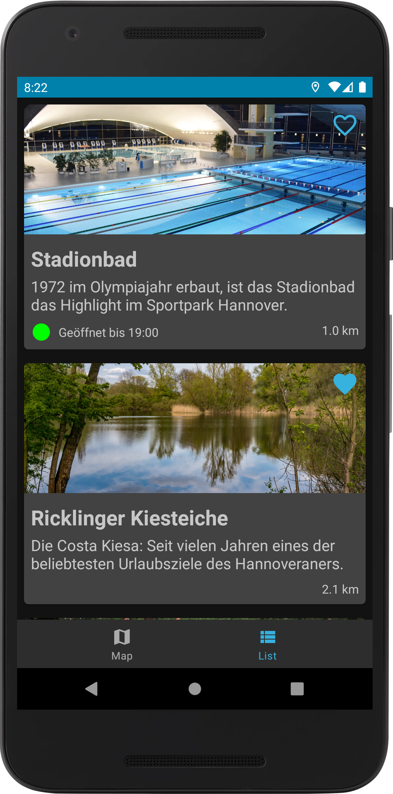

# Schwimmbad Guide

<p style="text-align: center">


</p>

## Installation
1. Download the latest files
2. Add Google Maps API Key to your gradle.properties file:
    - Get your personal API Key from https://console.cloud.google.com
    - Go to your Personal Folder/.gradle/ and open gradle.properties (Add file, if there is no one)
    - Adding code like these:
    ```
    <gradle.properties>
    Schwimmbad_Guide_MAP_API_KEY = "thisIsTheApiKey"
    </gradle.properties>
    ```
3. Start Android Studio and have fun with the code!